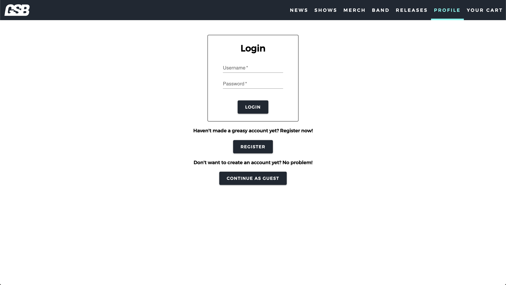

# GreasySauceBoss Band Website

The GreasySauceBoss Band band wants to grow and establish a web presence. This web application gives them a place to show who the band is, guides users to their music, and provides a platform to display and sell merchandise.

## Built With

React.js, Redux, JavaScript, Node.js, Express.js, SQL, Postgres, Material UI, HTML and CSS.

## Getting Started

### Prerequisites

- Node.js
- React.js
- Express.js
- Postgres

### Installing

1. Download or clone repo.
2. `npm install`
3. `npm start server` in one terminal window
4. `npm run client` in another terminal window

## Screen Shots

### Completed Features

- A menu at the top of every page to allow the user to effortlessly navigate the website
- Login/Registar for an account to view/add/purchase merchandise
- Manage shows and merchandise as an admin
- RESTful API/requests
- YouTube and Spotify embeded code for easy access to the band's media
- Admin pages for adding/editing/deleting merchandise and shows
- Error catching for forms

### Next Steps

- Make the web application fully responsive
- Add an image upload feature using AWS services
- Use the Stripe API to allow user payments